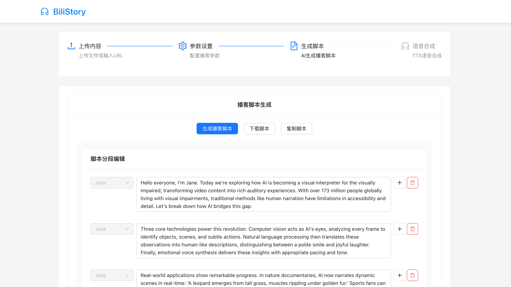

# 内容提取引擎

这是一个专业的内容提取引擎，可以从PDF、Word文档、文本文件和网页中提取结构化内容。

## 功能展示

### 1. 内容提取界面


### 2. 脚本生成界面


### 3. 语音合成界面


### 4. 参数设置界面


## 功能特点

- 支持多种文件格式（PDF、Word、TXT）
- 网页内容提取（使用Readability算法）
- 结构化输出（JSON格式）
- 保留原始格式和结构
- 智能内容过滤

## AI播客脚本生成器（Web应用）

本项目集成了AI驱动的播客脚本生成器，支持通过Web界面自动生成高质量、口语化的单人播客脚本，并支持一键语音合成。

### 主要功能
- 支持上传PDF、Word、TXT文件或输入网页URL，自动提取内容
- 一键生成播客脚本，输出纯台词内容，适合直接录制或语音合成
- 支持自定义播客名称、说话人姓名
- 支持输入"下期节目预告"作为可选变量，自动融入脚本结束语
- 结束语智能判断：如填写预告则自动生成预告，否则以引发思考的话结尾
- 支持脚本内容的在线编辑、复制、下载
- 实时显示脚本字数与预计朗读时长
- **新增：MiniMax TTS 语音合成功能**
  - 支持多种音色选择（青涩男声、青涩女声、中性男声、中性女声）
  - 可调节语速、音量、音调参数
  - 异步长文本语音合成，支持进度显示
  - 在线音频播放、下载功能
  - 历史合成任务管理

### 使用方法（Web端）
1. 启动后端服务：
   ```bash
   uvicorn webapp.main:app --reload --host 0.0.0.0
   ```
2. 浏览器访问首页，选择上传文件或输入URL
3. 填写播客名称、说话人、下期节目预告（可选）
4. 点击"生成播客脚本"按钮，稍等片刻即可获得AI生成的播客台词
5. 可对生成内容进行编辑、复制或下载
6. **语音合成**：
   - 选择音色和调节语音参数
   - 点击"开始语音合成"按钮
   - 等待合成完成，在线播放或下载音频

### 变量说明
- **播客名称**：可选，自动融入开场白和结束语
- **说话人**：可选，自动融入开场白
- **下期节目预告**：可选，填写后结束语将包含"下期节目，我们将探讨xxx"，否则以引发思考的话结尾

### 注意事项
- 生成脚本时需耐心等待，内容越长生成时间越久
- 需正确配置火山引擎API密钥和MiniMax TTS配置（见env.example）

## 大模型说明

本项目播客脚本生成部分基于**火山引擎 Ark（DeepSeek）大模型**实现。

- **模型服务商**：火山引擎（Volcengine）
- **模型类型**：Ark Runtime（DeepSeek）大语言模型
- **接入方式**：通过 `volcenginesdkarkruntime` Python SDK 调用，需配置推理接入点ID和API密钥
- **密钥配置**：
  - 在项目根目录下创建 `.env` 文件，填写如下内容：
    ```env
    ARK_API_KEY=你的API Key
    ARK_API_SECRET=你的API Secret
    ```
  - 推理接入点ID在 `ai_parser/podcast_generator.py` 中配置（如需更换模型请同步修改）
- **注意事项**：
  - 需确保API Key和Secret有效，否则无法生成播客脚本
  - 大模型生成内容较长时响应时间会增加，请耐心等待
  - 仅支持中文播客脚本生成

## MiniMax TTS 语音合成

本项目语音合成功能基于**MiniMax 异步长文本语音合成**实现。

### 功能特点
- **异步处理**：支持长文本语音合成，不阻塞用户操作
- **多音色选择**：提供青涩男声、青涩女声、中性男声、中性女声等多种音色
- **参数调节**：支持语速（0.5-2.0）、音量（0.5-2.0）、音调（0.5-2.0）调节
- **实时进度**：显示合成进度，支持任务状态查询
- **历史管理**：保存合成历史，支持重新播放和下载

### 配置说明
- **服务商**：MiniMax（MiniMax AI）
- **接入方式**：WebSocket API 异步调用
- **密钥配置**：
  - 在项目根目录下创建 `.env` 文件，添加以下配置：
    ```env
    MINIMAX_API_KEY=你的MiniMax API Key
    MINIMAX_GROUP_ID=你的MiniMax Group ID
    ```
- **获取密钥**：
  1. 登录 [MiniMax 官网](https://platform.minimaxi.com/)
  2. 创建应用并获取 API Key
  3. 获取 Group ID（通常在控制台可见）
  4. 确保账户已充值（语音合成为付费服务）

### 技术实现
- **后端**：`webapp/minimax_tts.py` - MiniMax TTS 客户端封装
- **API接口**：
  - `POST /synthesize_audio` - 创建语音合成任务
  - `GET /audio_status/{task_id}` - 查询任务状态
  - `GET /audio_result/{task_id}` - 获取合成结果
  - `GET /available_voices` - 获取可用音色列表
  - `GET /task_list` - 获取历史任务列表
- **前端**：实时进度显示、音频播放器、历史任务管理

### 注意事项
- MiniMax TTS 为付费服务，请确保账户余额充足
- 长文本合成需要较长时间，请耐心等待
- 合成任务有超时限制（默认5分钟），超时后需要重新提交
- 音频文件有保存期限，建议及时下载

## 安装

1. 克隆仓库：
```bash
git clone [repository-url]
cd [repository-name]
```

2. 安装依赖：
```bash
pip install -r requirements.txt
```

3. 配置环境变量：
```bash
cp env.example .env
# 编辑 .env 文件，填入你的 API 密钥
```

## 使用方法

### 处理文件

```python
from content_extractor import ContentExtractor

extractor = ContentExtractor()
result = extractor.process_file("path/to/your/file.pdf")
print(result)
```

### 处理网页

```python
from content_extractor import ContentExtractor

extractor = ContentExtractor()
result = extractor.process_url("https://example.com")
print(result)
```

## 输出格式

```json
{
  "source_type": "file/web",
  "title": "文档标题",
  "metadata": {
    "author": "作者",
    "date": "日期",
    "page_count": "页数/字数"
  },
  "content": [
    {
      "section_title": "章节标题",
      "text": "内容",
      "content_type": "paragraph/list/table/image"
    }
  ],
  "key_points": ["关键点1", "关键点2"],
  "cautions": "注意事项"
}
```

## 错误处理

系统会返回以下错误码：
- UNSUPPORTED_FORMAT：不支持的文件格式
- ACCESS_DENIED：网页访问受限
- NO_VALID_CONTENT：无法提取有效内容
- FILE_NOT_FOUND：文件不存在

## 注意事项

- 确保安装了所有必要的依赖
- 对于大文件，处理可能需要较长时间
- 网页提取可能需要处理反爬虫机制
- 语音合成功能需要配置 MiniMax API 密钥并确保账户余额充足 