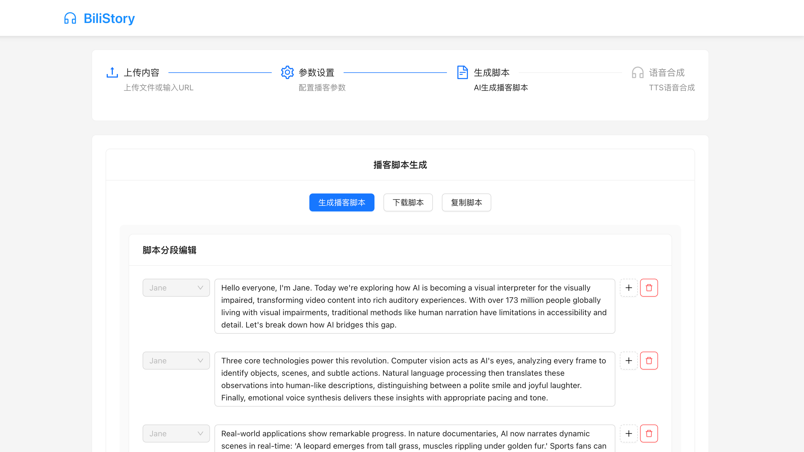

# 项目截图说明

## 建议添加的截图

为了展示项目的完整功能，建议在README.md中添加以下截图：

### 1. 主界面截图
- 文件上传区域
- 播客信息填写表单
- 整体界面布局

### 2. 脚本生成结果
- 生成的播客脚本内容
- 字数统计和预计时长显示

### 3. 脚本编辑器
- 在线编辑功能
- 角色选择和文本编辑界面

### 4. 语音合成功能
- 音色选择界面
- 参数调节面板
- 进度显示

### 5. 历史任务管理
- 合成历史列表
- 音频播放和下载功能

## 截图添加方法

1. 在项目根目录创建 `screenshots/` 文件夹
2. 将截图文件放入该文件夹
3. 在README.md中引用截图：

```markdown
## 功能展示

### 主界面


### 脚本生成


### 语音合成

```

## 截图建议

- 使用高分辨率截图（建议1920x1080或更高）
- 确保界面清晰，功能突出
- 可以添加简单的标注说明
- 保持截图风格一致 